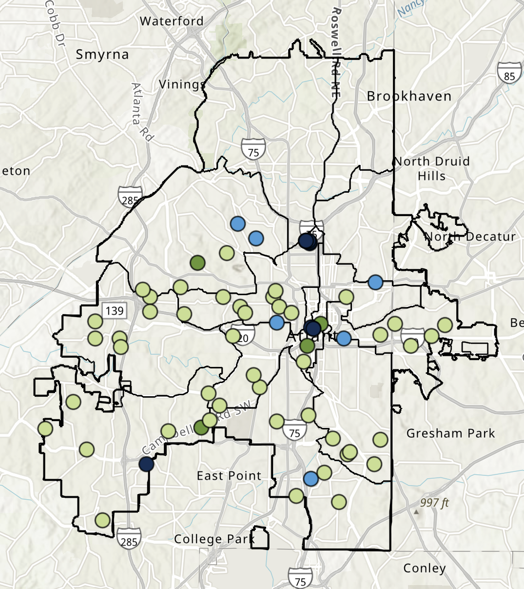

---
title: "Invest Atlanta Impact Dashboard"
subtitle: "Q1 2026 Results"
format: 
  dashboard:
    theme: cerulean
---

# Citywide Impact

## Row {height="30%"}

```{r, include = FALSE}
# quarto publish gh-pages index.qmd
library(tidyverse)
library(dplyr)
library(usethis)
library(devtools)
library(ggplot2)
library(ggtext)
library(ggrepel)
library(ggthemes)
library(extrafont)
library(readxl)
library(rmarkdown)
library(prettydoc)
library(knitr)
library(kableExtra)
library(sf)
library(RefManageR)
library(writexl)
library(shiny)
library(bslib)


plot_theme <- function() {
  font <- "Arial"
  theme_minimal() %+replace%
  theme(
    panel.grid.major = element_blank(),
    panel.grid.minor = element_blank(),
    axis.line = element_line(color = "#28282D", linewidth = 0.3),
    plot.title = element_text(
      family = font,
      size = 20,
      face = "bold",
      hjust = 0,
      vjust = 2),
    plot.subtitle = element_text(
      family = font,
      size = 12,
      hjust = 0),
    axis.title = element_text(
      family = font,
      size = 20),
    axis.text = element_text(
      family = font,
      size = 14) ) 
}


```

``` {r}
#| content: valuebox
#| title: "Total Capital Invested Across All Programs"
list(
  icon = "piggy-bank", 
  color = "primary", 
  value = "$71.1 Million"
  )
```

```{r}
#| content: valuebox
#| title: "Total Economic Impact"
list(
  icon = "award-fill",
  color = "success", 
  value = "$88.3 Million"
)
```

```{r}
#| content: valuebox
#| title: "Average Client Satisfaction Score (scale 1-5)"
list(
  icon = "pass", 
  color = "primary", 
  value = "5.0"
  )
```

``` {r}
#| content: valuebox
#| title: "Net Promoter Score"
list(
  icon = "people-fill", 
  color = "success", 
  value = "100"
  )
```


## Row {height="70%"}

``` {r}
#| title: "Total Capital Investment"

tot_inv <- data.frame(name = c("2026 YTD", "2026 Goal"), inv = c(71180949, 900000000))

ce_events <- data.frame(name = c("2026 YTD", "2026 Goal"), people = c(5, 4.4))

totinv_plot <- ggplot(tot_inv) +
  geom_col(aes(x = name, y = inv, fill = name), color = "#000000", show.legend = FALSE) +
  scale_x_discrete(name = " ", limits = c("2026 YTD", "2026 Goal")) +
  scale_y_continuous(name = "$ Invested", limits = c(0,910000000), 
                     expand = c(0,0), labels = scales::comma) +
  scale_fill_manual(values = c("#c8df8e", "#5e9732")) +
  plot_theme()
totinv_plot
```


``` {r}
#| title: "Average Client Satisfaction Rating"
events_plot <- ggplot(ce_events) +
  geom_col(aes(x = name, y = people, fill = name), color = "#000000", show.legend = FALSE) +
  scale_x_discrete(name = "Client Satisfaction", limits = c("2026 YTD", "2026 Goal")) +
  scale_y_continuous(name = "Satisfaction Rating (1-5)", limits = c(0,5.5), 
                     expand = c(0,0), labels = scales::comma) +
  scale_fill_manual(values = c("#5e9732", "#c8df8e")) +
  plot_theme()
#events_plot
```
[{width=51%}](https://iatl.maps.arcgis.com/apps/instant/basic/index.html?appid=112649da7b1d4fa58098c16cc402dcc4){target="_blank"}


# Small Business Investment

## Row {height="30%"}

``` {r}
#| content: valuebox
#| title: "Direct Investment"
list(
  icon = "piggy-bank", 
  color = "success", 
  value = "$540,000"
  )
```

```{r}
#| content: valuebox
#| title: "Small Businesses Funded (Grants and Loans)"
list(
  icon = "award-fill",
  color = "primary",
  value = 8
)
```


``` {r}
#| content: valuebox
#| title: "Small Businesses Receiving Business Consulting Services"
list(
  icon = "door-open", 
  color = "success", 
  value = "274"
  )
```


``` {r}
#| content: valuebox
#| title: "Small Business Funded in Priority Neighborhoods"
list(
  icon = "globe-americas", 
  color = "primary", 
  value = "37.5%"
  )
```


## Row {height="70%"}

``` {r}
#| title: "Small Business Investment"
sb_inv <- data.frame(name = c("2026 YTD", "2026 Goal"), inv = c(540000, 8500000))

sb_support <- data.frame(name = c("2026 YTD", "2026 Goal"), support = c(282, 1000))

sbinv_plot <- ggplot(sb_inv) +
  geom_col(aes(x = name, y = inv, fill = name), color = "#000000", show.legend = FALSE) +
  scale_x_discrete(name = "Small Business Investment", limits = c("2026 YTD", "2026 Goal")) +
  scale_y_continuous(name = "Direct Investment ($)", limits = c(0,11000000), 
                     expand = c(0,0), labels = scales::comma) +
  scale_fill_manual(values = c("#009ddc", "#002d56")) +
  plot_theme()
sbinv_plot
```


``` {r}
#| title: "Small Businesses Supported via Grants, Loans, and Consulting"
sbsupport_plot <- ggplot(sb_support) +
  geom_col(aes(x = name, y = support, fill = name), color = "#000000", show.legend = FALSE) +
  scale_x_discrete(name = "Total Support", 
                   limits = c("2026 YTD", "2026 Goal")) +
  scale_y_continuous(name = "Number of Small Businesses", limits = c(0,1100), 
                     expand = c(0,0), labels = scales::comma) +
  scale_fill_manual(values = c("#5e9732", "#c8df8e")) +
  plot_theme()
sbsupport_plot
```

``` {r}
#| title: "Small Business Industry Breakdown"

sb_ind <- data.frame(Industry = c("Technology", "Retail Stores", "Restaurants & Food Service", "Other"),
                     pct = c(.25, .25, .25, .25))
sb_ind <- sb_ind %>% mutate(prop = pct / sum(sb_ind$pct),
                            label = scales::percent(prop, accuracy = 0.1)) %>%
  arrange(prop) %>% mutate(ypos = cumsum(prop) - 0.5*prop, 
                           Industry = factor(Industry, levels = Industry[order(-(prop))], ordered = TRUE))

sbind_plot <- ggplot(sb_ind) +
  geom_bar(aes(x = "", y = pct, fill = Industry), color = "#000000", 
           stat = "identity", width = 1, show.legend = TRUE) +
  coord_polar("y", start = 0) +
  geom_text(aes(x = "", y = ypos, label = label), size = 5, color = "white") +
  scale_fill_manual(values = c("#5e9732", "#002d56", "#009ddc", "#c8df8e")) +
  theme_void() +
    theme(legend.position = 'bottom', legend.text = element_text(size = 12))
sbind_plot
```


# Neighborhood Investment


## Row {height="30%"}

``` {r}
#| content: valuebox
#| title: "Percentage of Projecs in Priority Nieghborhoods"
list(
  icon = "globe-americas",
  color = "primary",
  value = "64.7%"
)
```


```{r}
#| content: valuebox
#| title: "TAD Financing"
list(
  icon = "piggy-bank", 
  color = "success", 
  value = "$34.3 Million"
  )
```

```{r}
#| content: valuebox
#| title: "TAD Project Leveraged Capital"
list(
  icon = "door-open", 
  color = "primary", 
  value = "$401 Million"
  )
```


``` {r}
#| content: valuebox
#| title: "Invest Atlanta Community Engagement Events"
list(
  icon = "file-person",
  color = "success",
  value = "100"
)
```


## Row {height="70%"}

``` {r}
#| title: "Projects in Priority Neighborhoods"
nb_dn <- data.frame(Location = c("Disinvested Neighborhoods", "Citywide"), 
                    pct = c(35.3, 64.7))

nb_dn <- nb_dn %>% mutate(prop = pct / sum(nb_dn$pct), 
                          label = scales::percent(prop, accuracy = 0.1)) %>%
  arrange(prop) %>% mutate(ypos = cumsum(prop) - 0.5*prop, 
                           Location = factor(Location, levels = Location[order(-(prop))], ordered = TRUE))

nb_tad <- data.frame(Funding = c("Invest Atlanta Investment", "Leveraged Capital Investment"), 
                     support = c(97400000, 449713493.07))

nb_res <- data.frame(name = c("2026 YTD", "2026 Goal"), ppl = c(6151, 10000))

aemi_res <- data.frame(name = c("2026 YTD", "2026 Goal"), ppl = c(18255, 10000))

nbdn_plot <- ggplot(nb_dn) +
  geom_bar(aes(x = "", y = prop, fill = Location), color = "#000000", 
           stat = "identity", width = 1, show.legend = TRUE) +
  coord_polar("y", start = 0) +
  geom_text(aes(x = "", y = ypos, label = label), size = 4, color = "white") +
  scale_fill_manual(values = c("#009ddc", "#002d56")) +
  theme_void() +
  theme(legend.position = 'bottom', legend.text = element_text(size = 12))
nbdn_plot
```


``` {r}
#| title: "Investment in Neighborhood Development"
nbtad_plot <- ggplot(nb_tad) +
  geom_col(aes(x = name, y = support, fill = name), color = "#000000", show.legend = FALSE) +
  scale_x_discrete(name = "Neighborhood Investment", limits = c("Invest Atlanta", "Total Capital Investment")) +
  scale_y_continuous(name = "Investment ($)", limits = c(0,600000000), 
                     expand = c(0,0), labels = scales::comma) +
  scale_fill_manual(values = c("#5e9732", "#c8df8e")) +
  plot_theme()
#nbtad_plot
```


``` {r}
#| title: "Community Engagement: Invest Atlanta Events"
nbres_plot <- ggplot(nb_res) +
  geom_col(aes(x = name, y = ppl, fill = name), color = "#000000", show.legend = FALSE) +
  scale_x_discrete(name = " ", limits = c("2026 YTD", "2026 Goal")) +
  scale_y_continuous(name = "Attendees", limits = c(0,25000), 
                     expand = c(0,0), labels = scales::comma) +
  scale_fill_manual(values = c("#c8df8e", "#5e9732")) +
  plot_theme()
nbres_plot
```


``` {r}
#| title: "Neighborhood Revitalization Project Types" 

nb_rev <- data.frame(type = c("Affordable Housing", "Retail & Commercial", "Infrastructure"),
                     pct = c(.33, .5, .17))
nb_rev <- nb_rev %>% mutate(prop = pct / sum(nb_rev$pct), 
                          label = scales::percent(prop, accuracy = 0.1)) %>%
  arrange(prop) %>% mutate(ypos = cumsum(prop) - 0.5*prop, 
                           type = factor(type, levels = type[order(-(prop))], ordered = TRUE))

nbrev_plot <- ggplot(nb_rev) +
  geom_bar(aes(x = "", y = pct, fill = type), color = "#000000", 
           stat = "identity", width = 1, show.legend = TRUE) +
  coord_polar("y", start = 0) +
  geom_text(aes(x = "", y = ypos, label = label), size = 5, color = "white") +
  scale_fill_manual(values = c("#002d56", "#009ddc", "#c8df8e")) +
  labs(fill = "Project Type") +
  theme_void() +
    theme(legend.position = 'bottom', legend.text = element_text(size = 12))
nbrev_plot
```

# Housing


## Row {height="30%"}

``` {r}
#| content: valuebox
#| title: "Direct Investment (Housing)"
list(
  icon = "piggy-bank", 
  color = "success", 
  value = "$3 Million"
  )
```

```{r}
#| content: valuebox
#| title: "Total Capital Investment (Housing)"
list(
  icon = "piggy-bank", 
  color = "primary", 
  value = "$16.5 Million"
  )
```


``` {r}
#| content: valuebox
#| title: "Total Affordable Housing Units Financed"
list(
  icon = "house-add",
  color = "success",
  value = "113"
)
```


``` {r}
#| content: valuebox
#| title: "Homeownership Incentives (Down Payment, Home Rehab)"
list(
  icon = "house-door", 
  color = "primary", 
  value = 42
  )
```

## Row {height="70%"}

``` {r}
#| title: "Affordable Housing Units Financed"
hs_ahu <- data.frame(name = c("2026 YTD", "2026 Goal"), inv = c(113, 1100))

hs_ho <- data.frame(name = c("2026 YTD", "2026 Goal"), support = c(42, 363))

hsahu_plot <- ggplot(hs_ahu) +
  geom_col(aes(x = name, y = inv, fill = name), color = "#000000", show.legend = FALSE) +
  scale_x_discrete(name = "Affordable Housing Units Funded", limits = c("2026 YTD", "2026 Goal")) +
  scale_y_continuous(name = "Number of Affordable Housing Units", limits = c(0,1150), 
                     expand = c(0,0), labels = scales::comma) +
  scale_fill_manual(values = c("#009ddc", "#002d56")) +
  plot_theme()

hsahu_plot
```


``` {r}
#| title: "Homeownership Incentives Provided"
hsho_plot <- ggplot(hs_ho) +
  geom_col(aes(x = name, y = support, fill = name), color = "#000000", show.legend = FALSE) +
  scale_x_discrete(name = " ", limits = c("2026 YTD", "2026 Goal")) +
  scale_y_continuous(name = "Number of Homeowners", limits = c(0,375), 
                     expand = c(0,0), labels = scales::comma) +
  scale_fill_manual(values = c("#5e9732", "#c8df8e")) +
  plot_theme()
hsho_plot
```

```{r}
#| title: "Housing Investments: Percentage Affordable"
units <- data.frame(years = c('2018','2019', '2020', '2021', '2022', '2023', '2024', '2025', '2026'),
                    aff = c(57.3, 55.5, 83.7, 83.0, 94.6, 85.9, 91, 84.1, 100))
housing_aff <- ggplot(units) +
  geom_col(aes(x=years, y=aff), fill = "#009DDC", color = "#000000") +
  scale_y_continuous(name = "Affordable Housing Funded (%)", expand = c(0,0)) +
  scale_x_discrete(name = "Year") +
  plot_theme()
housing_aff
```


# Jobs & Employment

## Row {height="30%"}

``` {r}
#| content: valuebox
#| title: "Total Capital Investment (Jobs & Employment)"
list(
  icon = "door-open", 
  color = "primary", 
  value = "$21.3 Million"
  )
```

``` {r}
#| content: valuebox
#| title: "Total Jobs Impact"
list(
  icon = "bag-dash-fill", 
  color = "success", 
  value = "282"
  )
```

```{r}
#| content: valuebox
#| title: "Business Development Projects"
list(
  icon = "building",
  color = "primary",
  value = 11
)
```

```{r}
#| content: valuebox
#| title: "Total Economic Impact (Jobs & Employment)"
list(
  icon = "file-earmark-bar-graph-fill",
  color = "success",
  value = "$26.8 Million"
)

```


## Row {height="70%"}

``` {r}
#| title: "Business Development Projects"

biz_dev <- data.frame(name = c("2026 YTD", "2026 Goal"), closed = c(11, 40))

new_jobs <- data.frame(name = c("2026 YTD", "2026 Goal"), jobs = c(286, 3000))

good_jobs <- data.frame(name = c("2026 YTD", "2026 Goal"), good = c(0, 1000))

bizdev_plot <- ggplot(biz_dev) +
  geom_col(aes(x = name, y = closed, fill = name), color = "#000000", show.legend = FALSE) +
  #ggtitle("Small Business Investment") +
  scale_x_discrete(name = "Business Development", limits = c("2026 YTD", "2026 Goal")) +
  scale_y_continuous(name = "Number of Closed Projects", limits = c(0,55), 
                     expand = c(0,0), labels = scales::comma) +
  scale_fill_manual(values = c("#009ddc", "#002d56")) +
  plot_theme()
#bizdev_plot
```


``` {r}
#| title: "Job Creation & Retention"
newjobs_plot <- ggplot(new_jobs) +
  geom_col(aes(x = name, y = jobs, fill = name), color = "#000000", show.legend = FALSE) +
  scale_x_discrete(name = "Employment Impact", limits = c("2026 YTD", "2026 Goal")) +
  scale_y_continuous(name = "Number of Jobs", limits = c(0,3000), 
                     expand = c(0,0), labels = scales::comma) +
  scale_fill_manual(values = c("#5e9732", "#c8df8e")) +
  plot_theme()
newjobs_plot
```


``` {r}
#| title: "Middle Wage Jobs Created"
goodjobs_plot <- ggplot(good_jobs) +
  geom_col(aes(x = name, y = good, fill = name), color = "#000000", show.legend = FALSE) +
  #ggtitle("Small Businesses Supported") 
  scale_x_discrete(name = "New Middle-Wage Jobs", limits = c("2026 YTD", "2026 Goal")) +
  scale_y_continuous(name = "Number of Good Jobs", limits = c(0,1100), 
                     expand = c(0,0), labels = scales::comma) +
  scale_fill_manual(values = c("#002d56", "#009ddc")) +
  plot_theme()
goodjobs_plot
```


```{r}
#| title: "Closed Business Development Projects by Priority Industry"

sectors <- data.frame(Industry = c("Fresh Food Access", "Technology & Innovation", 
                                   "Retail & Dining", "Other"), 
                      total = c(.091, .091, .454, .363))
sectors <- sectors %>% mutate(prop = total / sum(sectors$total), 
                          label = scales::percent(prop, accuracy = 0.1)) %>%
  arrange(prop) %>% mutate(ypos = cumsum(prop) - 0.5*prop, 
                           Industry = factor(Industry, levels = Industry[order(-(prop))], ordered = TRUE))

sectors_plot <- ggplot(sectors) +
  geom_bar(aes(x = "", y = total, fill = Industry), color = "#000000", 
           stat = "identity", width = 1, show.legend = TRUE) +
  coord_polar("y", start = 0) +
  geom_text(aes(x = "", y = ypos, label = label), size = 5, color = "white") +
  scale_fill_manual(values = c("#5e9732", "#002d56", "#009ddc", "#c8df8e")) +
  theme_void() +
    theme(legend.position = 'bottom', legend.text = element_text(size = 12))
sectors_plot
```


```{r}

# This is just a chart we want for the annual report
# Looking into % completion for 20,000 affordable housing units (Mayor's goal)
# 7,919 units from IA and 13,187 overall (including City projects, AH, etc)

ah <- data.frame(name = c("Invest Atlanta", "All Developments", "2030 Goal"),
                 units = c(7919, 13187, 20000))

ah_plot <- ggplot(ah) +
  geom_col(aes(x = name, y = units, fill = name), color = "#000000", show.legend = FALSE) +
  scale_x_discrete(name = "Affordable Housing Units Funded", 
                   limits = c("Invest Atlanta", "All Developments", "2030 Goal")) +
  scale_y_continuous(name = "Number of Units", limits = c(0,30002), 
                     expand = c(0,0), labels = scales::comma) +
  scale_fill_manual(values = c("#5e9732", "#c8df8e", "#009ddc")) +
  plot_theme()
#ah_plot

```


